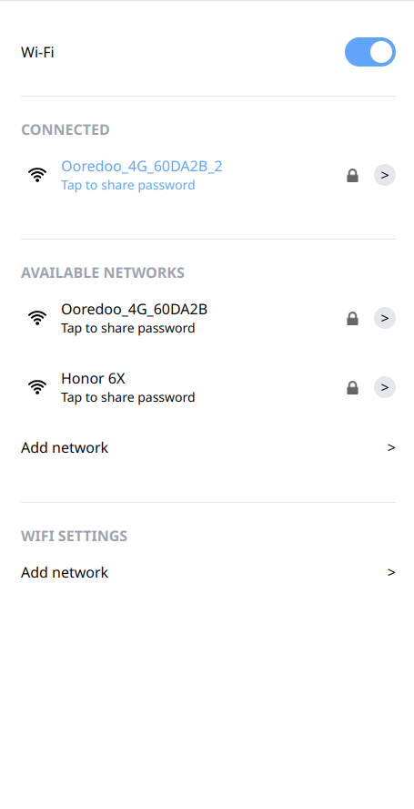
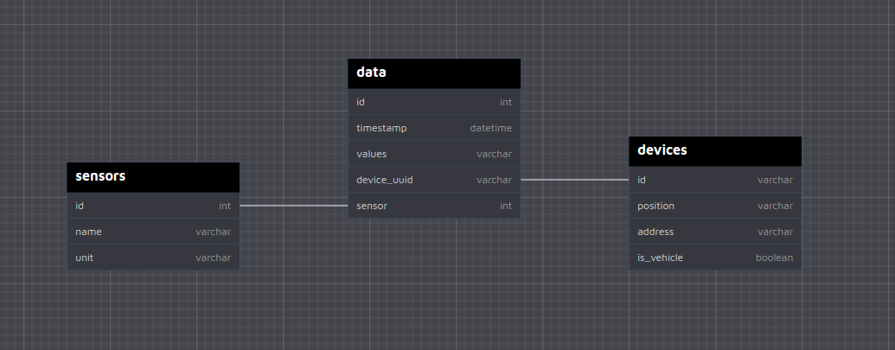

# ESP32 API
+ AP IP address: 192.168.4.1
+ Port: 80 (http)
+ `/`
Serves SPIFFS files
+ `/scan`
```json
{
    "others": [
        {
            "text":"imed wifi",
            "sigStrength":"2",
            "select":"0"
        },
        {
            "text":"Honor 6X",
            "sigStrength":"1",
            "select":"0"
        },
        {
            "text":"HUAWEI-B5328-206D",
            "sigStrength":"1",
            "select":"0"
        }
    ]
}
```
+ Wifi scan interface


# Esp32 interface
1. Install dependencies
```bash
npm i
# or:
bun i
```
2. Build SPA
```bash
npm run build
# or:
bun run build
```
3. Copy `dist` files
```bash
cp -r dist/* site-serv/data
```
4. Upload `site-serv/data` to SPIFFS partition
# Backend
## RESTful api (Rust using actix framework)

## SQL DB (Mysql/Mariadb)

